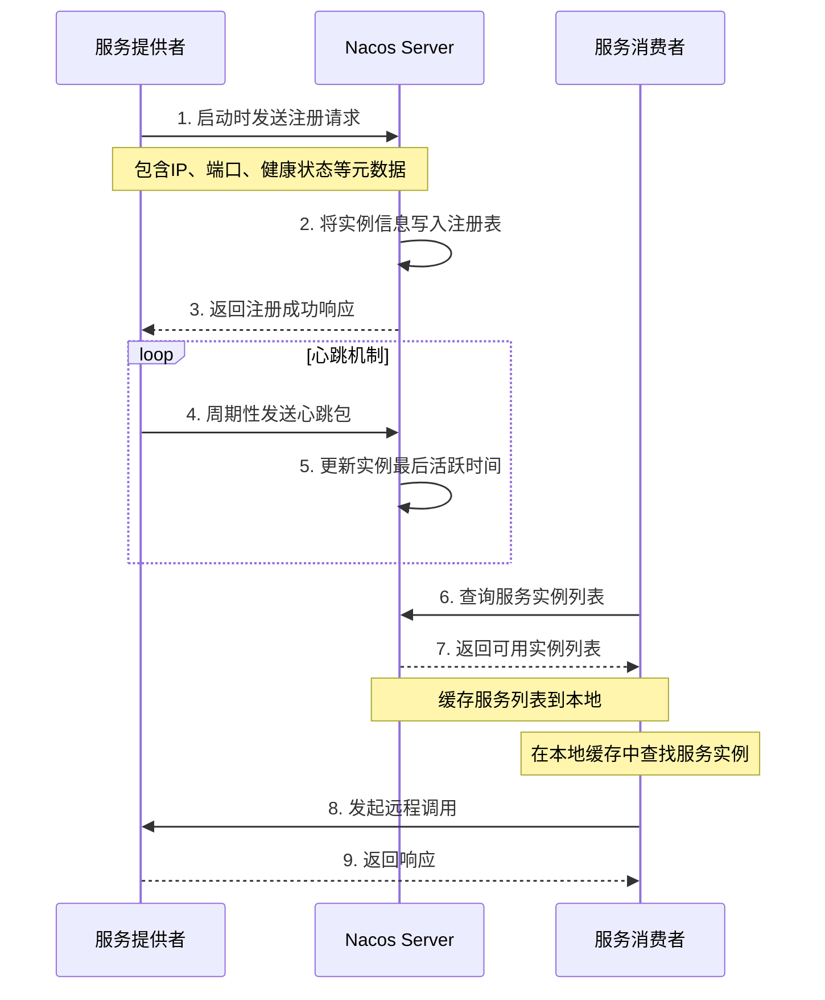
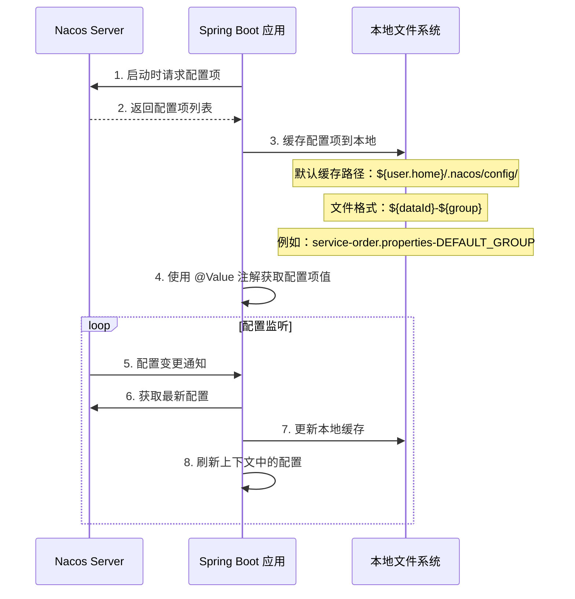
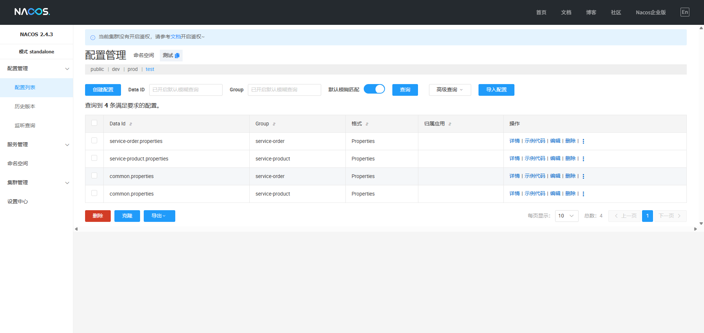
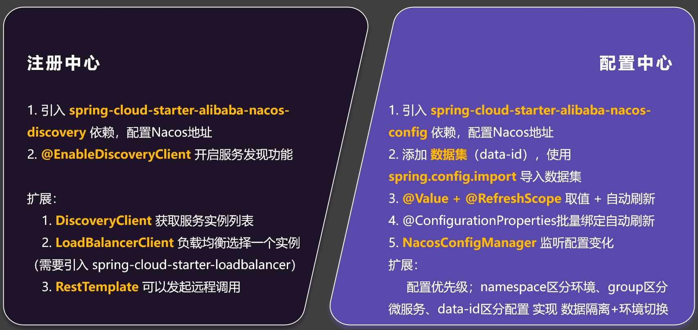
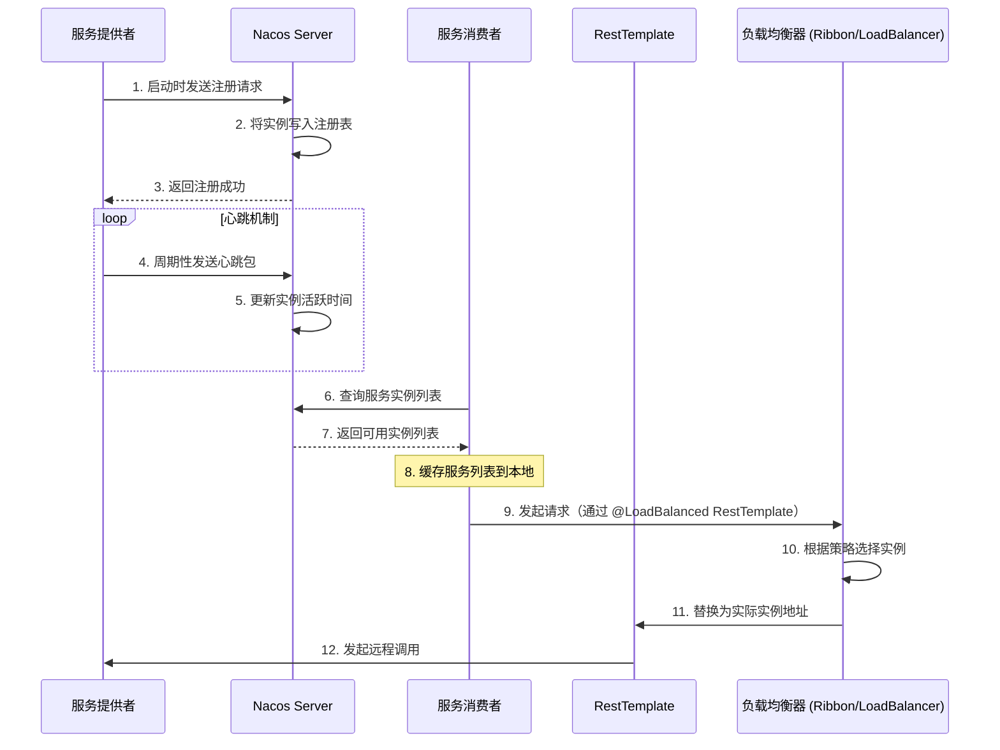

# 一、Nacos 相关知识

## 1. 什么是 Nacos？

Nacos（Dynamic Naming and Configuration Service）是阿里巴巴开源的一个更易于构建云原生应用的动态服务发现、配置管理和服务管理平台。Nacos 致力于帮助开发者发现、配置和管理微服务。

## 2. Nacos 核心特性

- **服务发现与健康检查**：Nacos 支持基于 DNS 和基于 RPC 的服务发现，能够帮助您更好的实现服务自动注册与发现功能。
- **动态配置管理**：动态配置服务允许您在所有环境中以集中和动态的方式管理所有应用程序的配置。
- **动态 DNS 服务**：支持权重路由，让您更容易地实现中间层负载均衡、更灵活的路由策略、流量控制以及简单的 DNS 解析服务。
- **服务及其元数据管理**：支持从微服务平台建设的视角管理服务及其元数据。

## 3. Nacos 在 Spring Cloud Alibaba 中的应用

在 Spring Cloud Alibaba 生态系统中，Nacos 提供：

1. **服务注册与发现**：替代 Eureka、Consul 等组件
2. **配置中心**：替代 Spring Cloud Config 等组件

## 4. 快速入门案例

### 4.1. 部署 Nacos 单机服务器

Nacos 支持多种安装方式，包括 Docker、Kubernetes、二进制包等。这里以二进制包和Docker为例：

```bash
# 下载 Nacos
wget https://github.com/alibaba/nacos/releases/download/2.x.x/nacos-server-2.x.x.zip
# 解压
unzip nacos-server-2.x.x.zip
# 启动服务（单机模式）
cd nacos/bin
sh startup.sh -m standalone
```

```bash
# 使用 Docker 启动 Nacos
docker run -d --name nacos-standalone -e MODE=standalone -p 8848:8848 nacos/nacos-server
```

访问 Nacos 控制台：`http://localhost:8848/nacos`，如果开启鉴权，则默认用户名和密码均为 `nacos`。

### 4.2. 服务注册与发现

添加 Maven 依赖：

```xml
<!-- nacos-discovery -->
<dependency>
    <groupId>com.alibaba.cloud</groupId>
    <artifactId>spring-cloud-starter-alibaba-nacos-discovery</artifactId>
</dependency>
```

并在 `application.properties` 或 `bootstrap.properties` 文件中添加：

```properties
# 服务名称
spring.application.name=service-order
# Nacos 服务器地址
spring.cloud.nacos.discovery.server-addr=127.0.0.1:8848
```

#### 4.2.1. 服务注册

在 SpringBoot 启动类上添加 `@EnableDiscoveryClient` 注解：

```java
@EnableDiscoveryClient
@SpringBootApplication
public class ServiceOrderApplication {
    public static void main(String[] args) {
        SpringApplication.run(ServiceOrderApplication.class,args);
    }
}
```

有了该注解，Spring Boot 应用就会自动注册到 Nacos 服务注册中心。以下是Nacos服务注册和发现流程图：



在上面流程图中，我们可以看到服务注册和发现的完整流程：

1. 首先，服务提供者在启动时向Nacos服务器发送注册请求，包含服务实例的IP、端口和健康状态等元数据信息。Nacos服务器接收到请求后，将服务实例信息写入注册表，并返回注册成功的响应。
2. 为了保持服务实例的活跃状态，服务提供者会定期向Nacos发送心跳包，Nacos接收到心跳包后会更新服务实例的最后活跃时间。这种心跳机制确保了Nacos能够及时发现不可用的服务实例。
3. 当服务消费者需要调用某个服务时，会向Nacos查询该服务的可用实例列表。Nacos返回可用的服务实例列表后，服务消费者会将这些信息缓存到本地，以便在后续调用中使用。在进行实际调用时，服务消费者首先在本地缓存中查找服务实例，然后向选择的服务实例发起远程调用，最后接收服务提供者返回的响应。
4. 这种机制不仅实现了服务的自动注册和发现，还通过本地缓存提高了服务调用的性能和可靠性。即使Nacos服务器暂时不可用，服务消费者仍然可以通过本地缓存的服务实例列表进行服务调用。

#### 4.2.2. 服务发现和简单服务调用

在 OrderServiceImpl 中使用 `DiscoveryClient` 来进行服务发现，并使用 `RestTemplate` 进行服务调用：

```java
@Slf4j
@Service
public class OrderServiceImpl implements OrderService {

    @Resource
    DiscoveryClient discoveryClient;

    @Resource
    RestTemplate restTemplate;

    @Override
    public Order createOrder(Long productId, Long userId) {
        Product product = getProductFromRemote(productId);
        Order order = new Order();
        order.setId(1L);
        // 总金额
        if (product != null) {
            order.setTotalAmount(product.getPrice().multiply(BigDecimal.valueOf(product.getNum())));
        }
        order.setUserId(userId);
        order.setNickName("ccd");
        order.setAddress("5060Ti");
        // 商品详情
        if (product != null) {
            order.setProductList(List.of(product));
        }
        return order;
    }


    private Product getProductFromRemote(Long productId){
        List<ServiceInstance> instances = discoveryClient.getInstances("service-product");
            if (instances != null && !instances.isEmpty()) {
                ServiceInstance instance = instances.get(0);
                String url = "http://"+instance.getHost()+":"+instance.getPort()+"/products/product/"+productId;
                log.info("开始发送请求-->ip:{}  port:{}",instance.getHost(),instance.getPort());
                return restTemplate.getForObject(url, Product.class);
            }
        return null;
    }
}
```

在上面的代码中，我们使用 `DiscoveryClient` 获取服务实例列表，然后使用 `RestTemplate` 调用其中一个实例的接口。`RestTemplate` 是 Spring 提供的用于 HTTP 客户端的工具类，可以方便地发送 HTTP 请求和处理响应。


### 4.3. 负载均衡

在 Spring Cloud Alibaba 中，Nacos 本身并不直接提供负载均衡的实现，但通过与 Spring Cloud 的负载均衡组件（如 Ribbon 或 Spring Cloud LoadBalancer）集成，可以实现客户端负载均衡功能。
在 Nacos 与 Spring Cloud 结合的环境中，负载均衡通常通过以下方式实现：

- Spring Cloud LoadBalancer(推荐)
  - 提供轮询(Round Robin)、随机(Random)等默认策略
  - 可自定义负载均衡策略
  - 支持服务权重等高级功能
- Netflix Ribbon(已进入维护模式)
  - 提供更多预置负载均衡策略，如区域感知、响应时间加权等
  - 通过配置可切换不同策略

#### 4.3.1. Spring Cloud LoadBalancer 简介

Spring Cloud LoadBalancer 是 Spring Cloud 提供的一个负载均衡组件，支持多种负载均衡策略，如随机、轮询、加权等。在 Spring Cloud Alibaba 中，Nacos 与 Spring Cloud LoadBalancer 集成，可以实现基于 Nacos 的服务发现和负载均衡。

#### 4.3. 使用 Spring Cloud LoadBalancer 实现负载均衡

在 Spring Boot 应用中使用 Spring Cloud LoadBalancer 实现负载均衡，可以通过以下步骤实现：

添加 Maven 依赖：

```xml
<!-- spring-cloud-starter-loadbalancer -->
<dependency>
    <groupId>org.springframework.cloud</groupId>
    <artifactId>spring-cloud-starter-loadbalancer</artifactId>
</dependency>
```

##### 4.3.3. 使用 loadBalancerClient 接口

在 OrderServiceImpl 中使用 `LoadBalancerClient` 来进行负载均衡的服务调用：

```java
@Slf4j
@Service
public class OrderServiceImpl implements OrderService {

    @Resource
    DiscoveryClient discoveryClient;

    @Resource
    RestTemplate restTemplate;

    @Resource
    LoadBalancerClient loadBalancerClient;

    @Override
    public Order createOrder(Long productId, Long userId) {

        Product product = getProductFromRemoteWithLoadBalancedAnnotation(productId);

        Order order = new Order();
        order.setId(1L);
        // 总金额
        if (product != null) {
            order.setTotalAmount(product.getPrice().multiply(BigDecimal.valueOf(product.getNum())));
        }
        order.setUserId(userId);
        order.setNickName("ccd");
        order.setAddress("5060Ti");
        // 商品详情
        if (product != null) {
            order.setProductList(List.of(product));
        }

        return order;
    }

    private Product getProductFromRemoteWithLoadbalancer(Long productId){

        ServiceInstance choose = loadBalancerClient.choose("service-product");

        String url = "http://"+choose.getHost()+":"+choose.getPort()+"/products/product/"+productId;

        log.info("开始远程请求 --> url:{}",url);

        return restTemplate.getForObject(url, Product.class);
    }
}
```

在上面的代码中，我们使用 `LoadBalancerClient` 的 `choose` 方法获取一个服务实例，然后使用 `RestTemplate` 调用该实例的接口。`RestTemplate` 会自动处理负载均衡逻辑，将请求发送到选择的服务实例上。

##### 4.3.4. 使用 @LoadBalanced 注解

在 Spring Boot 应用中使用 `@LoadBalanced` 注解来实现负载均衡的服务调用：

1、在配置类中定义 `RestTemplate` Bean，并添加 `@LoadBalanced` 注解：

```java
@Configuration
public class ProductServiceConfiguration {

    @Bean
    @LoadBalanced
    public RestTemplate restTemplate(){
        return new RestTemplate();
    }
}
```

2、在 OrderServiceImpl 中使用 `RestTemplate` 进行负载均衡的服务调用：

```java
@Slf4j
@Service
public class OrderServiceImpl implements OrderService {

    @Resource
    DiscoveryClient discoveryClient;

    @Resource
    RestTemplate restTemplate;

    @Override
    public Order createOrder(Long productId, Long userId) {

        Product product = getProductFromRemoteWithLoadBalancedAnnotation(productId);

        Order order = new Order();
        order.setId(1L);
        // 总金额
        if (product != null) {
            order.setTotalAmount(product.getPrice().multiply(BigDecimal.valueOf(product.getNum())));
        }
        order.setUserId(userId);
        order.setNickName("ccd");
        order.setAddress("5060Ti");
        // 商品详情
        if (product != null) {
            order.setProductList(List.of(product));
        }

        return order;
    }

    private Product getProductFromRemoteWithLoadBalancedAnnotation(Long productId){

        String url = "http://service-product/products/product/"+productId; // service-product会被动态替换成对应的ip以及port

        return restTemplate.getForObject(url, Product.class);
    }
}
```

在上面的代码中，我们使用 `@LoadBalanced` 注解标记的 `RestTemplate` Bean 来进行负载均衡的服务调用。通过在 URL 中使用服务名称（如 `http://service-product`），`RestTemplate` 会自动处理负载均衡逻辑，将请求发送到可用的服务实例上。在 `getProductFromRemoteWithLoadBalancedAnnotation` 方法中，我们使用 `RestTemplate` 发送请求，Nacos 会根据服务名称解析到对应的服务实例，并进行负载均衡。


### 4.4. 配置中心

Nacos 还可以作为配置中心来管理应用程序的配置。通过 Nacos 的配置管理功能，可以集中管理和动态更新应用程序的配置，支持多种格式的配置文件，如 YAML、properties 等。Nacos 还支持配置的灰度发布和动态推送，能够帮助开发者更灵活地管理应用配置。

添加 Maven 依赖：

```xml
<!-- nacos-config -->
<dependency>
    <groupId>com.alibaba.cloud</groupId>
    <artifactId>spring-cloud-starter-alibaba-nacos-config</artifactId>
</dependency>
```

并在 `application.properties` 或 `bootstrap.properties` 文件中添加需要导入的配置文件：

```properties
spring.config.import=nacos:service-order.properties
```

上面的配置表示从 Nacos 中导入 `service-order.properties` 配置文件。
同时我们也要在 Nacos 的配置列表中创建一个 data id 为 `service-order.properties` 的配置文件，并添加一些配置项：

```properties
# service-order.properties
# 配置项示例
order.server.port=8080
order.spring.application.name=service-order
order.spring.datasource.url=jdbc:mysql://localhost:3306/order_db
order.spring.datasource.username=root
order.spring.datasource.password=123456
# 其他配置项可以根据需要添加
```

#### 4.4.1. 配置中心基本用法

现在我们就可以直接在 Spring Boot 应用中使用这些配置项了,只需要在需要使用的地方注入 `@Value` 并使用 `${}` 占位符来获取配置项的值,如下所示：

```java
@RestController
@RequestMapping("/orders")
public class OrderController {

    @Value("${order.server.port}")
    private String port;

    @Value("${order.spring.datasource.url}")
    private String url;

    @GetMapping("/nacos/config")
    public String getNacosOfConfigValue(){
        return "配置文件中的port: {"+port+"} 和url: {"+url+"}";
    }
}
```

在上面的代码中，我们使用 `@Value` 注解来获取 Nacos 配置中心中的配置项值。通过 `${}` 占位符，我们可以直接引用配置项的名称，Spring Boot 会自动从 Nacos 中加载对应的配置值。Spring Boot 加载 Nacos 配置文件以及动态配置更新的流程如下图所示：



#### 4.4.2. 动态配置更新 —— @RefreshScope

Nacos 支持动态配置更新，当配置发生变化时，Nacos 会通过事件通知机制将最新的配置推送到应用程序。Spring Boot 应用可以通过 `@RefreshScope` 注解来实现动态刷新配置：

```java
@RefreshScope // 该注解表示该类的实例会在配置更新时被刷新
@RestController
public class ConfigController {

    @Value("${order.server.port}")
    private String port; // 这个值会在配置变更时更新

    @Value("${order.spring.datasource.url}")
    private String url; // 这个值会在配置变更时更新

    @GetMapping("/nacos/config")
    public String getNacosOfConfigValue() {
        return "配置文件中的port: {" + port + "} 和url: {" + url + "}";
    }
}
```

在上面的代码中，我们使用 `@RefreshScope` 注解标记了 `ConfigController` 类，并使用 `@Value` 注解来获取对应值。这样当配置发生变化时，Spring Boot 会自动刷新该类的实例，并更新其中的配置项值。

#### 4.4.3. 动态配置更新 —— @ConfigurationProperties (推荐使用)
当我们使用 `@RefreshScope` + `@Value` 来实现动态配置的更新时，我们会发现不利于动态配置属性的管理以及会有大量的重复性代码。所以我们应该使用 `@ConfigurationProperties` 注解用于标记需要动态刷新的配置类。与 `@RefreshScope` 类似，当配置发生变化时，Spring Boot 会自动刷新该类的实例，并更新其中的配置项值。
```properties
# service-order.properties
# 配置项示例
order.port=123123
order.url=自定义url
```
```java
@Component
@ConfigurationProperties(prefix = "order") // prefix表示配置项的前缀
@Data
public class ServiceOrderProperties {

    private String port;

    private String url;

}
```

```java
@RestController
@RequestMapping("/orders")
public class OrderController {

    @Resource
    ServiceOrderProperties serviceOrderProperties;

    @GetMapping("/nacos/config")
    public String getNacosOfConfigValue(){

        return "配置文件中的port: {"+serviceOrderProperties.getPort()+"} 和url: {"+serviceOrderProperties.getUrl()+"}";
    }
}
```
在上面的代码中，我们使用 `@ConfigurationProperties` 注解来标记 `ServiceOrderProperties` 类,并指定前缀为 `myconfig`。这样，Spring Boot 会自动将 Nacos 中以 `myconfig` 为前缀的配置项映射到该类的属性中。通过使用 `@ConfigurationProperties` 注解，我们可以更方便地管理和使用动态配置项，并且避免了大量的重复性代码。


#### 4.4.4. 配置监听

Nacos 支持配置监听，当配置发生变化时，Nacos 会通过事件通知机制将最新的配置推送到应用程序。我们可以使用 `ApplicationRunner` 和 `NacosConfigManager` 来实现配置监听：

```java
@Slf4j
@Component
public class NacosConfigChangeListener {

    /**
     * 监听配置文件的变化
     * @param nacosConfigManager NacosConfigManager
     * @return ApplicationRunner
     */
    @Bean
    public ApplicationRunner applicationRunner(NacosConfigManager nacosConfigManager) { // spring 会将@Bean所需要的参数组件，自动装配到参数中
        return args -> {
            ConfigService configService = nacosConfigManager.getConfigService();
            // 监听配置变化
            configService.addListener("service-order.properties", "DEFAULT_GROUP", new Listener() {

                @Override
                public Executor getExecutor() {
                    return Executors.newFixedThreadPool(4);
                }

                @Override
                public void receiveConfigInfo(String configInfo) {
                    configInfo = configInfo.replace("\n", "").replace("\r", "");
                    log.info("配置文件发生变化，新的配置为: {}", configInfo);
                    // 进行业务通知相关操作
                    log.info("短信通知业务......");
                }
            });
        };
    }
}
```
在上面的代码中，我们使用 `NacosConfigManager` 获取 `ConfigService`，并通过 `addListener` 方法添加配置监听器。当配置发生变化时，`receiveConfigInfo` 方法会被调用，我们可以在该方法中进行业务通知相关操作。

#### 4.4.5. 数据隔离

为什么要使用数据隔离？数据隔离可以将不同服务的配置项进行隔离，确保每个服务只能访问自己的配置项，从而避免了配置项冲突和数据污染的问题。eg.最简单的例子就是：我们需要在不同的环境中使用不同的配置项，比如开发环境、测试环境和生产环境。我们可以通过数据隔离来实现这一点。我们可以在 Nacos 中创建不同的命名空间（namespace），每个命名空间对应一个环境。然后在每个命名空间中创建不同的配置项。



在上面的图中，我们可以看到不同的命名空间（namespace）对应不同的环境（dev、test、prod），每个命名空间中都有不同的配置项。这样就实现了数据隔离。


## 5. 总结




# 二、Nacos 相关面试题

## 1. Nacos服务宕机后，远程调用还能成功吗？

答：可以。Nacos的服务注册和发现是基于心跳机制的，服务实例在注册到Nacos后，会定期向Nacos发送心跳请求以保持注册状态。如果Nacos宕机，服务实例仍然可以通过本地缓存的服务列表进行调用，但无法获取新的服务实例信息。当Nacos恢复后，服务实例会重新向Nacos注册并更新服务列表。

在下面的流程图中，我们可以看到服务注册和发现以及服务调用的完整流程



## 2. @RefreshScope 刷新类实例的原理

答：`@RefreshScope` 注解用于标记需要动态刷新的 Bean。当配置发生变化时，Spring Boot 会通过 `@RefreshScope` 注解标记的 Bean 的实例进行刷新。具体原理如下：

1. **Bean 创建**：当 Spring Boot 应用启动时，`@RefreshScope` 注解标记的 Bean 会被创建并初始化。
2. **配置监听**：Spring Boot 会注册一个配置监听器，当 Nacos 中的配置发生变化时，监听器会收到通知。
3. **刷新 Bean**：当配置发生变化时，Spring Boot 会调用 `@RefreshScope` 注解标记的 Bean 的 `refresh()` 方法，重新加载配置并更新 Bean 的属性值。
4. **更新上下文**：Spring Boot 会将新的配置值注入到 `@RefreshScope` 注解标记的 Bean 中，从而实现动态刷新配置的效果。
5. **通知依赖 Bean**：如果有其他 Bean 依赖于 `@RefreshScope` 注解标记的 Bean，Spring Boot 会通知这些 Bean 进行刷新，以确保它们使用最新的配置值。
6. **完成刷新**：最终，所有依赖于 `@RefreshScope` 注解标记的 Bean 的实例都会被刷新，应用程序可以使用最新的配置值。
7. **缓存机制**：Spring Boot 会将 `@RefreshScope` 注解标记的 Bean 的实例缓存到本地，以提高性能。只有在配置发生变化时，才会重新加载配置并更新 Bean 的实例。
8. **多线程安全**：Spring Boot 会确保 `@RefreshScope` 注解标记的 Bean 的实例在多线程环境下是安全的，避免出现线程安全问题。
9. **使用场景**：`@RefreshScope` 注解适用于需要动态更新配置的场景，如数据库连接信息、API 接口地址等。通过使用 `@RefreshScope` 注解，可以实现配置的动态更新，而无需重启应用程序。

> [!NOTE] @RefreshScope 的使用场景
**注意：** `@RefreshScope` 注解只能用于 Spring 管理的 Bean，不能用于普通的 Java 对象。同时，`@RefreshScope` 注解标记的 Bean 不能是单例 Bean，因为单例 Bean 在应用程序启动时就会被创建，而 `@RefreshScope` 注解标记的 Bean 会在配置发生变化时才会被创建。


## 3. Nacos中的数据集和application.properties有相同的配置项，哪个生效？

答：我们在使用 Nacos 作为配置中心时，我们会使用 `spring.config.import` 来导入 Nacos 中的配置项。并且会遵循**外部配置优先于内部配置，先导入的配置优先于后导入的配置**的规则。即 `外部优先,先导入优先` 。所以在 Nacos 中的数据集配置项与 `application.properties` 中的配置项相同的情况下，Nacos 中的配置项会覆盖 `application.properties` 中的配置项。

<div style="text-align: center">
<svg width="600" height="300" xmlns="http://www.w3.org/2000/svg">
    <!-- 背景 -->
    <rect width="600" height="300" fill="#ffffff" rx="10" ry="10" />
    <rect x="40" y="40" width="150" height="60" fill="#ffffff" stroke="#333333" stroke-width="2" />
    <text x="115" y="75" font-family="Arial" font-size="14" text-anchor="middle">高优先级配置</text>
    <rect x="40" y="160" width="150" height="60" fill="#ffffff" stroke="#333333" stroke-width="2" />
    <text x="115" y="195" font-family="Arial" font-size="14" text-anchor="middle">低优先级配置</text>
    <line x1="190" y1="70" x2="240" y2="130" stroke="#333333" stroke-width="2" />
    <line x1="190" y1="190" x2="240" y2="130" stroke="#333333" stroke-width="2" />
    <text x="210" y="115" font-family="Arial" font-size="12" text-anchor="middle">合并</text>
    <rect x="250" y="100" width="150" height="60" fill="#ffffff" stroke="#333333" stroke-width="2" />
    <text x="325" y="135" font-family="Arial" font-size="14" text-anchor="middle">生效的配置</text>
    <line x1="400" y1="130" x2="460" y2="130" stroke="#333333" stroke-width="2" marker-end="url(#arrowhead)" />
    <text x="430" y="120" font-family="Arial" font-size="12" text-anchor="middle">存入</text>
    <rect x="470" y="100" width="110" height="60" fill="#ffffff" stroke="#333333" stroke-width="2" />
    <text x="525" y="135" font-family="Arial" font-size="14" text-anchor="middle">环境变量</text>
    <line x1="525" y1="160" x2="525" y2="210" stroke="#333333" stroke-width="2" marker-end="url(#arrowhead)" />
    <text x="510" y="190" font-family="Arial" font-size="12" text-anchor="middle">获取</text>
    <rect x="470" y="220" width="110" height="60" fill="#ffffff" stroke="#333333" stroke-width="2" />
    <text x="525" y="255" font-family="Arial" font-size="14" text-anchor="middle">环境变量</text>
    <defs>
        <marker id="arrowhead" markerWidth="10" markerHeight="7" refX="9" refY="3.5" orient="auto">
            <polygon points="0 0, 10 3.5, 0 7" fill="#333333" />
        </marker>
    </defs>
</svg>
</div>

> [!NOTE] 回答思路
> **注意：** 引入配置中心（不论是Nacos还是其他配置中心）的目的就是为了**集中管理和动态更新配置项**，因此**Nacos**中的配置项会优先于 `application.properties` 中的配置项生效。