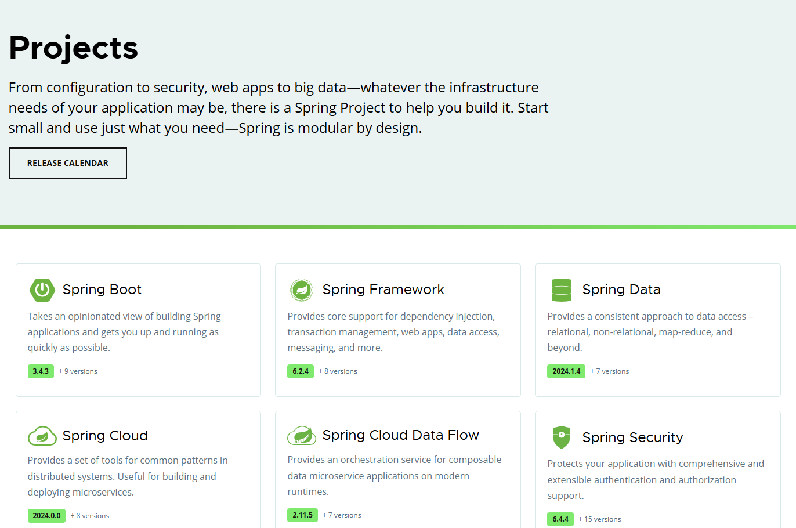

# 1. Spring 家族框架体系概述
Spring 家族框架体系是 Java 领域最流行的企业级**开发框架集合**，其核心目标是简化复杂应用开发

# 2. Spring 家族框架体系组成
Spring 家族框架体系主要有以下框架：

 
    

        <ul style="margin: 0; padding-left: 20px; flex-grow: 1;"> 
            <li>Spring Framework (Spring 核心框架)</li>
            <li>Spring Boot (简化 Spring 应用开发的框架)</li>
            <li>Spring Cloud (基于 Spring Boot 实现的微服务框架)</li>
            <li>Spring Data (简化数据库访问的框架)</li>
            <li>Spring Security (安全框架)</li>
            <li>Spring Session (会话管理框架)</li>
            <li>Spring Batch (批处理框架)</li>
            <li>Spring Integration (集成框架)</li>
            <li>Spring AI （AI集成框架）</li>
            <li>......</li>
        </ul>
    

    

        

             
        

    

